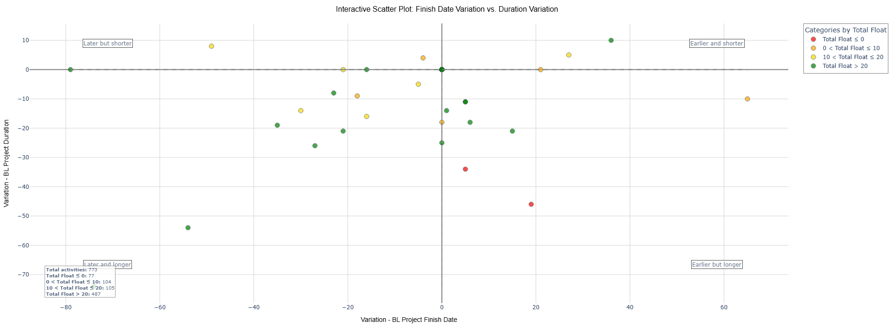

# SCATTER Finish and Duration Variance

An interactive data visualization tool for analyzing project activities by their finish date variance and duration variance, categorized by Total Float values.



## Overview

This tool helps project managers analyze activity performance by visualizing the relationship between:
- Variance in Project Finish Date
- Variance in Project Duration
- Total Float values

The visualization is divided into four quadrants:
- **Earlier and shorter**: Activities finishing earlier than planned with shorter duration
- **Earlier but longer**: Activities finishing earlier despite longer duration
- **Later but shorter**: Activities finishing later despite shorter duration
- **Later and longer**: Activities finishing later with longer duration

Each activity is color-coded based on its Total Float value:
- 🔴 **Total Float ≤ 0**: Critical activities (red)
- 🟠 **0 < Total Float ≤ 10**: Near-critical activities (orange)
- 🟡 **10 < Total Float ≤ 20**: Medium float activities (gold)
- 🟢 **Total Float > 20**: High float activities (green)

## Requirements

```
pip install -r requirements.txt
```

## Usage

1. Prepare your Excel file with project activities data. The file must contain the following columns:
   - `Activity ID`
   - `Activity Name`
   - `Activity Status`
   - `Variance - BL Project Finish Date`
   - `Variance - BL Project Duration`
   - `Total Float`
   
   **Primavera P6 Users**: You can generate the required Excel file using the Primavera layout `SCATTER Finish and Duration Variance.plf`. Simply import this layout into Primavera P6 and export your project data.

2. Run the visualization using the simple script:
   ```python
   python simple_run.py
   ```

   Or use the more advanced script with command-line options:
   ```python
   python run_visualization.py --excel your_data.xlsx --output custom_output
   ```

3. By default, the script will:
   - Generate an interactive scatter plot
   - Create an Excel file with activities grouped by Total Float category
   - Save an interactive HTML version of the plot
   - Display statistics about the analyzed activities

## Features

- **Interactive filtering**: Click on legend items to filter activities by category
- **Detailed tooltips**: Hover over points to see complete activity details
- **Quadrant analysis**: Visual and statistical breakdown of each performance quadrant
- **Excel export**: Categorized activities exported to separate Excel sheets for further analysis
- **Performance insights**: Quick visual identification of critical activities requiring attention
- **Export capabilities**: The interactive HTML allows downloading as PNG directly from the browser

## Data Preparation

### Generating data from Primavera P6

To generate the input Excel file from Primavera P6:

1. Import the layout file `SCATTER Finish and Duration Variance.plf` into Primavera P6
2. Apply the layout to your project view
3. Export the data to Excel format (File > Export)
4. Save the file as `SCATTER Finish and Duration Variance.xlsx` in the same directory as the scripts

This layout is specifically configured to export the required columns in the correct format.

## Customization

You can customize the analysis by modifying parameters in the command line:

```bash
# Specify a different input file
python run_visualization.py --excel your_data.xlsx

# Custom output name
python run_visualization.py --output custom_chart

# Skip Excel generation
python run_visualization.py --no-excel
```

Or by modifying the function parameters directly:

```python
fig, statistics = create_interactive_scatter_plot(
    'your_data.xlsx', 
    generate_excel=True,
    excel_name='custom_output.xlsx'
)
```

## License

This project is under the Apache License. See LICENSE file for details.
